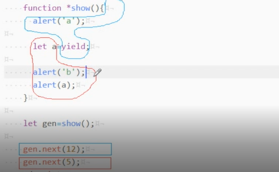
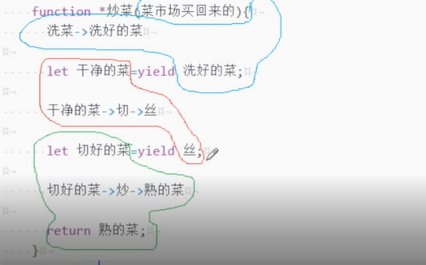

# generator--生成器

> 普通函数：一路到底<br>
> generator函数：中间能停

## 1. generator函数
```javascript
function* show() {
    alert(1);
    yield;
    alert(2);
}

function show_1() {
    alert(1);
}

function show_2() {
    alert(2);
}

let genObj = show();
genObj.next();//show_1
genObj.next();//show_2
```
## 2. yield(传参、返回)
*yield意为放弃执行*
### 2.1 传参



```javascript
function* show(num1, num2) {
    alert('${num1},${num2}');

    alert('a');
    let num = yield;
    alert('b');
}

let genObj = show(11, 22);
genObj.next(12); //没法给yield传参，此时yield为5
genObj.next(5); //
```

### 2.2 返回



```javascript
 function* show2() {
    alert('a');
    yield 12;
    alert('b');
    
    return 99;
}
let genObj2 = show2();
let res1 = genObj2.next();
console.log(res1); //{value: 12,done: false}

let res2 = genObj2.next();
console.log(res2); //{value: 99,done: true}
```


